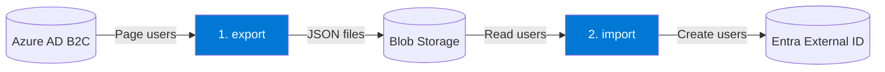
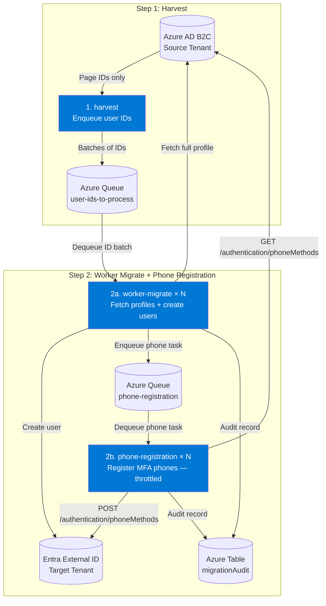
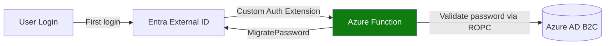

# Azure AD B2C to Entra External ID Migration Kit

> **⚠️ PREVIEW/SAMPLE STATUS**  
> This is a **sample implementation** showcasing the [Just-In-Time password migration public preview](https://learn.microsoft.com/entra/external-id/customers/how-to-migrate-passwords-just-in-time). 

A toolkit for migrating users from Azure AD B2C to Microsoft Entra External ID with minimal downtime and seamless password migration through Just-In-Time (JIT) authentication.

## 🎯 Overview

This migration kit provides a sample solution for identity migration with:

- ✅ **Two Bulk Migration Modes** — choose the right complexity for your bulk user export/import
- ✅ **Just-In-Time (JIT) Password Migration** — seamless password migration on user's first login (independent of bulk mode choice)

### Choose Your Bulk Migration Mode

Both modes handle bulk user export/import. JIT password migration works independently with either mode — it runs as an Azure Function triggered on each user's first login.

| | **Simple Mode: Export/Import** | **Advanced Mode: Queue-based Workers** |
|---|---|---|
| **Commands** | `export` → `import` | `harvest` → `worker-migrate` + `phone-registration` |
| **Best for** | Small or Medium tenants < 1 million users, no MFA phones | Large tenants, MFA phone migration |
| **Azure infra** | Blob Storage only | Blob + Queue + Table Storage |
| **Parallelism** | Single process | N workers in parallel |
| **MFA phones** | ❌ Not implemented | ✅ Available |
| **Complexity** | Low — 2 sequential commands | Medium — 3 commands, parallel workers |

## 🏗️ Architecture

**Key Components:**

1. **B2CMigrationKit.Console** — CLI tool with 5 bulk migration commands (export, import, harvest, worker-migrate, phone-registration)
2. **B2CMigrationKit.Function** — Azure Function for JIT password migration
3. **B2CMigrationKit.Core** — Shared business logic and services

### Simple Mode: Export/Import

### Advanced Mode: Queue-based Workers

### JIT Password Migration (works with both modes)

After bulk migration (either mode), users have accounts in External ID but no password yet. On each user's first login, JIT seamlessly migrates their password:

---

## 🔑 Key Features

### ✅ Currently Available

- **Simple Mode: Export/Import** — Simple two-step bulk migration via Blob Storage; ideal for smaller tenants without MFA phone migration needs
- **Advanced Mode: Harvest + Worker Migrate** — Harvest phase enqueues user IDs; N parallel worker-migrate instances fetch full B2C profiles and create users directly in EEID
- **Async Phone Registration** (Advanced Mode) — MFA phone numbers fetched from B2C and registered in EEID at a throttle-safe rate 
- **Audit Trail** — Every user operation (Created, Duplicate, Failed, PhoneRegistered, PhoneSkipped) written to Azure Table Storage (`migrationAudit`)
- **JIT Password Migration** via Custom Authentication Extension
- **UPN Domain Transformation** preserving local-part identifiers as a workaround to enable [sign-in alias](https://learn.microsoft.com/en-us/entra/external-id/customers/how-to-sign-in-alias) functionality
- **Built-in Retry Logic** with exponential backoff
- **Structured Logging** with optional Application Insights telemetry
- **Local Development Mode** using Azurite emulator (no Azure resources)
  
> **⚠️ PREVIEW/SAMPLE STATUS**: This toolkit is currently a **sample implementation** to showcase how to implement the [Just-In-Time password migration public preview](https://learn.microsoft.com/en-us/entra/external-id/customers/how-to-migrate-passwords-just-in-time?tabs=graph) for bulk migration and JIT password migration. 

## 📚 Documentation

This migration kit includes two comprehensive guides:

### [Architecture Guide](docs/ARCHITECTURE_GUIDE.md)
Complete architectural overview for solutions architects, technical leads, and security reviewers:
- Executive summary and system design
- Component architecture (Harvest, Worker-Migrate, Phone-Registration, JIT)
- Security architecture and compliance patterns
- Scalability, performance benchmarks, and multi-instance deployments
- Deployment topologies and operational considerations
- Cost optimization strategies

**Target Audience:** Solutions Architects, Technical Leads, Security Reviewers

### [Developer Guide](docs/DEVELOPER_GUIDE.md)
Complete technical reference for developers implementing and operating the migration:
- Project structure and configuration guide
- Development workflow and local setup
- JIT (Just-In-Time) migration implementation with RSA keys and Custom Authentication Extensions
- Attribute mapping configuration and UPN transformation
- Import audit logs for compliance tracking
- Scaling for high-volume migrations (>100K users)
- Operations, logging, and troubleshooting
- Security best practices and deployment procedures

**Target Audience:** Developers, DevOps Engineers, Operations Teams

## 🤝 Contributing

We welcome contributions! Please see our [Contributing Guide](CONTRIBUTING.md) for details on:
- How to set up your development environment
- Coding standards and best practices
- Submitting pull requests
- Reporting issues

## 🔒 Security

Security is a top priority. If you discover a security vulnerability, please follow our [Security Policy](SECURITY.md) for responsible disclosure.

## 💬 Support

For questions, issues, or discussions, please see our [Support Guide](SUPPORT.md).

## Code of Conduct

This project has adopted the [Microsoft Open Source Code of Conduct](https://opensource.microsoft.com/codeofconduct/). For more information see the [Code of Conduct FAQ](https://opensource.microsoft.com/codeofconduct/faq/) or contact [opencode@microsoft.com](mailto:opencode@microsoft.com) with any additional questions or comments.

## 📄 License

This project is licensed under the MIT License - see the [LICENSE](LICENSE) file for details.

## ™️ Trademarks

This project may contain trademarks or logos for projects, products, or services. Authorized use of Microsoft trademarks or logos is subject to and must follow [Microsoft's Trademark & Brand Guidelines](https://www.microsoft.com/legal/intellectualproperty/trademarks/usage/general). Use of Microsoft trademarks or logos in modified versions of this project must not cause confusion or imply Microsoft sponsorship. Any use of third-party trademarks or logos are subject to those third-party's policies.

